**通过opencv和numpy实现的数据增强模块。**

------

# RandAugment

- 论文地址：https://arxiv.org/pdf/1909.13719.pdf
- 开源代码github地址：https://github.com/heartInsert/randaugment
- **AutoAugment**的搜索方法比较暴力，直接在数据集上搜索针对该数据集的最优策略，其计算量很大。在**RandAugment**文章中作者发现，一方面，针对越大的模型，越大的数据集，使用**AutoAugment**方式搜索到的增广方式产生的收益也就越小；另一方面，这种搜索出的最优策略是针对该数据集的，其迁移能力较差，并不太适合迁移到其他数据集上。
- 在**RandAugment**中，作者提出了一种随机增广的方式，不再像**AutoAugment**中那样使用特定的概率确定是否使用某种子策略，而是所有的子策略都会以同样的概率被选择到，论文中的实验也表明这种数据增广方式即使在大模型的训练中也具有很好的效果。

## 测试使用

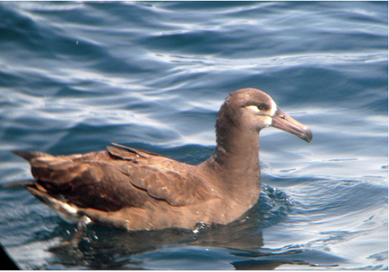

```python
image = cv2.imread(filename, flags=1)[:, :, [2, 1, 0]]
augment = RandAugment(size=image.shape[:-1], number=3)
image = augment(image)
```

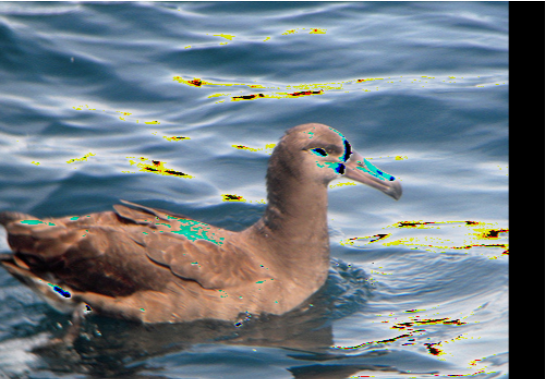

```python
image = cv2.imread(filename, flags=1)[:, :, [2, 1, 0]]
augment = RandAugment(size=image.shape[:-1], number=3)
image = augment.shearY(image, 0.2)
```

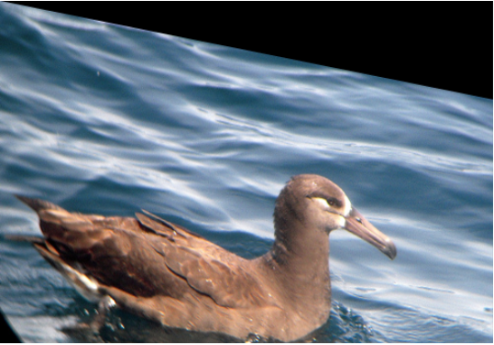

## 添加功能

- 原功能有14个，分别是“autocontrast“，“equalize“，“rotate“，“solarize“，“color“，“posterize“, “contrast“,  “brightness“，“sharpness“，“shearX“，“shearY“，“translateX“，“translateY“。

- 添加new_func：

  - self.transforms中加入"new_func"；

  - self.ranges中加入new_func的范围；

  - 定义new_func：

    ```python
    def new_func(self, img, m):
    	# 处理图像
    	return img
    ```

  - self.functions中加入new_func。

# GridMask

- 论文地址：https://arxiv.org/abs/2001.04086
- 开源代码github地址：https://github.com/akuxcw/GridMask
- 作者在论文中指出，此前存在的基于对图像crop的方法存在两个问题，如下图所示：
  - 过度删除区域可能造成目标主体大部分甚至全部被删除，或者导致上下文信息的丢失，导致增广后的数据成为噪声数据；
  - 保留过多的区域，对目标主体及上下文基本产生不了什么影响，失去增广的意义。
- 因此如果避免过度删除或过度保留成为需要解决的核心问题。
- **GridMask**是通过生成一个与原图分辨率相同的掩码，并将掩码进行随机翻转，与原图相乘，从而得到增广后的图像，通过超参数控制生成的掩码网格的大小。
- 在训练过程中，有两种以下使用方法：
  - 设置一个概率p，从训练开始就对图片以概率p使用**GridMask**进行增广。
  - 一开始设置增广概率为0，随着迭代轮数增加，对训练图片进行**GridMask**增广的概率逐渐增大，最后变为p。
- 论文中验证上述第二种方法的训练效果更好一些。

## 测试使用

```python
image = cv2.imread(filename, flags=1)[:, :, [2, 1, 0]]
augment = GridMask()
image = augment(image)
```

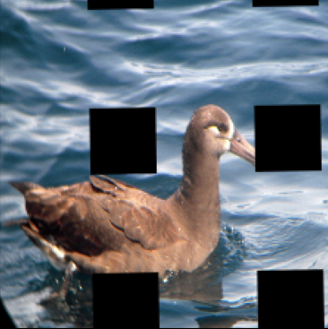

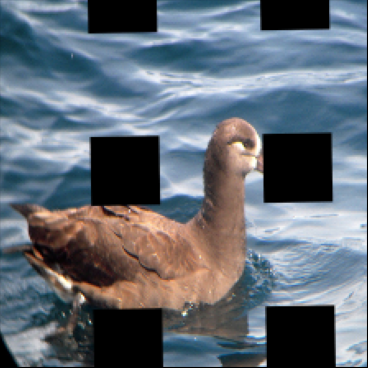

# MixUp

- 论文地址：https://arxiv.org/pdf/1710.09412.pdf

- 开源代码github地址：https://github.com/facebookresearch/mixup-cifar10

- **MixUp**是最先提出的图像混叠增广方案，其原理简单、方便实现，不仅在图像分类上，在目标检测上也取得了不错的效果。为了便于实现，通常只对一个batch内的数据进行混叠，在 **CutMix**中也是如此。

- 采用插值的思想：

  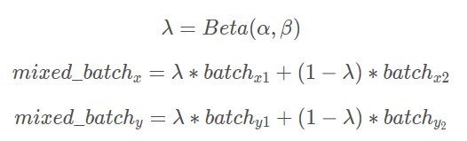

## 测试使用

```python
images, labels = [], []
for i in os.listdir(path1):
    images.append(cv2.resize(cv2.imread(path1 + i, flags=1)[:, :, [2, 1, 0]], (224, 224)))
    labels.append(np.array([1, 0]))
for i in os.listdir(path2):
    images.append(cv2.resize(cv2.imread(path2 + i, flags=1)[:, :, [2, 1, 0]], (224, 224)))
    labels.append(np.array([0, 1]))
images = np.asarray(images, dtype=np.float) / 255.
labels = np.asarray(labels, dtype=np.float)

augment = MixUp()
images, labels = augment(images, labels)
```

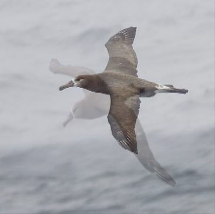

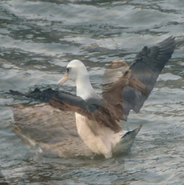

# CutMix

- 论文地址：https://arxiv.org/pdf/1905.04899v2.pdf

- 开源代码github地址：https://github.com/clovaai/CutMix-PyTorch

- 与**MixUp**直接对两幅图进行相加不一样，**CutMix**是从一幅图中随机裁剪出一个ROI，然后覆盖当前图像中对应的区域。

- 采用拼接的思想：

  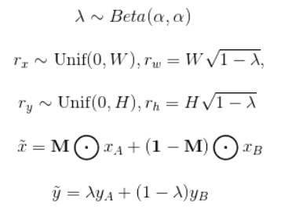

## 测试使用

```python
images, labels = [], []
for i in os.listdir(path1):
    images.append(cv2.resize(cv2.imread(path1 + i, flags=1)[:, :, [2, 1, 0]], (224, 224)))
    labels.append(np.array([1, 0]))
for i in os.listdir(path2):
    images.append(cv2.resize(cv2.imread(path2 + i, flags=1)[:, :, [2, 1, 0]], (224, 224)))
    labels.append(np.array([0, 1]))
images = np.asarray(images, dtype=np.float) / 255.
labels = np.asarray(labels, dtype=np.float)

augment = CutMix()
images, labels = augment(images, labels)
```

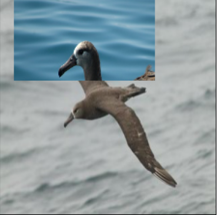

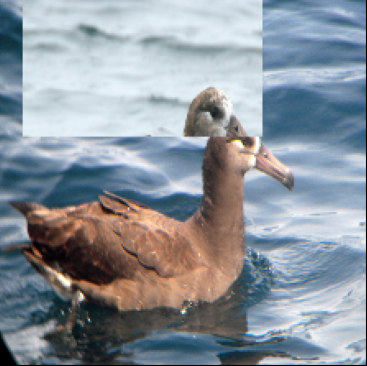